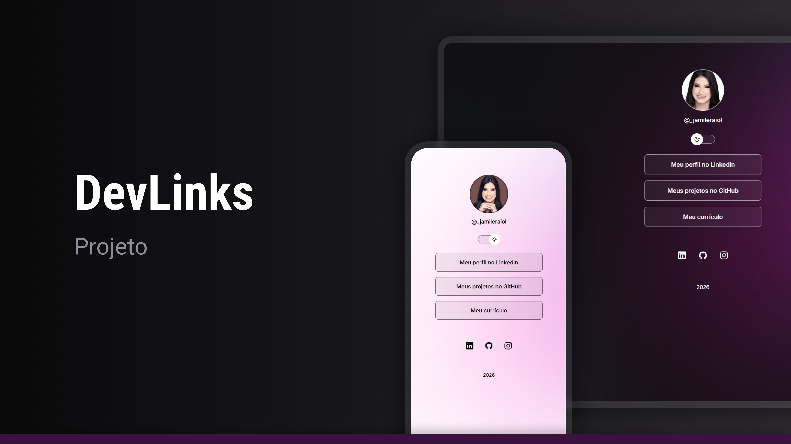

<h1 align="center"> Gerenciador de Links </h1>

 Aprendizados práticos de desenvolvimento front-end, unindo o design de interface à lógica de programação para entregar uma experiência fluida e funcional.  

  <a href="#-tecnologias">Tecnologias</a>&nbsp;&nbsp;&nbsp;|&nbsp;&nbsp;&nbsp;
  <a href="#-projeto">Projeto</a>&nbsp;&nbsp;&nbsp;

  
  
  

 

  

## 🚀 Tecnologias

Esse projeto foi desenvolvido com as seguintes tecnologias:

- Visual Studio Code
- HTML e CSS
- JavaScript
- Git e Github
- Figma

## 📌 Sobre o Projeto

Este projeto é um _Gerenciador de Links_, uma aplicação web desenvolvida com o objetivo de centralizar, organizar e facilitar o acesso a links importantes em um só lugar. A ferramenta funciona como uma interface intuitiva onde o usuário pode visualizar seus canais de comunicação, portfólios ou redes sociais de forma rápida e integrada.

## 💻 Projeto

- [Acesse o projeto finalizado, online](https://jaraiol.github.io/Gerenciador-de-link/)

---

♥ by JamileRaiol ♥
